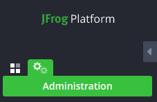
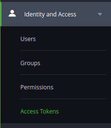
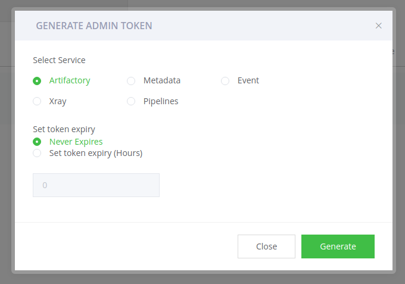
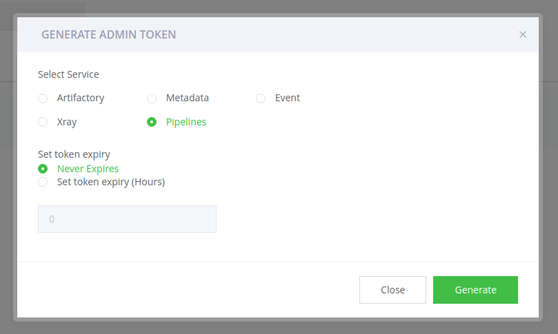

# Development

This integration focuses on [JFrog Artifactory](https://jfrog.com/artifactory/)
and is using
[JFrog Artifactory REST API](https://www.jfrog.com/confluence/display/JFROG/Artifactory+REST+API)
for interacting with the JFrog Artifactory platform.

## Provider account setup

### Cloud JFrog Artifactory Setup

To set up a JFrog Artifactory account, please follow these steps:

1. Visit the [JFrog Sign Up](https://jfrog.com/artifactory/start-free/) page,
   select "Cloud" and submit the form/follow through with the procedure.
2. Once done, you will receive an email containing your account information and
   a link ([your organization].jfrog.io) to the dashboard for your organization.

## Authentication

1. Once logged in, navigate to the "Administrator" section by clicking on the
   cog looking button on the top left side.



2. Next you need to select "Identity And Access" panel and select the "Access
   Tokens" sub-menu item.



3. To create an access token you need to click "+ Generate Admin Token" button
   found on the top right. After a new modal appears, make sure Artifactory is
   selected and set the expiration based on your needs. Then click "Generate".



4. A new modal will appear containing the access token. It is shown only once,
   so make sure to save it somewhere or you'll need to re-create it again later.

5. Copy the API Key, create a .env file at the root of this project, and set the
   CLIENT_ACCESS_TOKEN variable with the copied value.

```bash
CLIENT_ACCESS_TOKEN="paste the access token value here"
```

6. The next step is to include the hostname in the `.env` file. Put the host
   part of the URL that you received from the email that you received from JFrog
   ([this part].jfrog.io).

```bash
CLIENT_ACCESS_TOKEN="paste the access token value here"
CLIENT_NAMESPACE="your organization name"
```

7. The final step is to also include the pipeline access token. Creation process
   is similar, you just make sure that the "Pipelines" service is selected on
   the modal after you click on the "+ Generate Admin Token" button on the same
   Access Tokens page.



```bash
CLIENT_ACCESS_TOKEN="paste the access token value here"
CLIENT_NAMESPACE="your organization name"
CLIENT_PIPELINE_ACCESS_TOKEN="paste the pipeline token generated from the previous step here"
```

After following the above steps, you should now be able to start contributing to
this integration. The integration will pull in the `CLIENT_ACCESS_TOKEN` and
`CLIENT_NAMESPACE` variables from the `.env` file and use them when making
requests.
